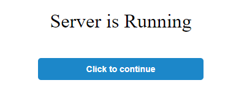
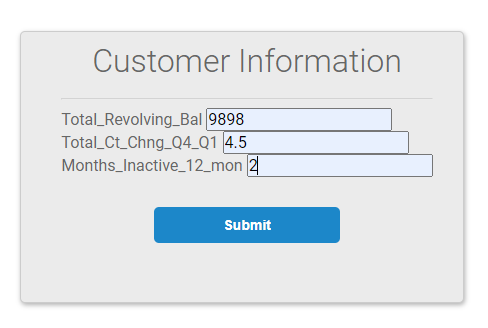
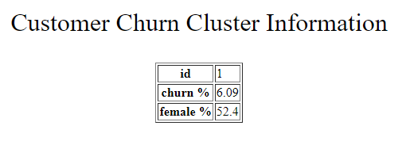

## churn_prediction
#### Description
The objective of the project is to develop a clustering machine learning model that help the bank to predict if a (new) customer will stay in the bank or will churn. The application has been deployed in [heroku](https://ml-churn-prediction.herokuapp.com/).

#### Installation
In order to run the program, install the libraries in the `requirements.txt`. 

#### Usage
1. `Clustering.ipynb` contains all the codes related to the data preprocessing, training and prediction from the mode.
2. In the `model` folder, `clustering_model.sav` is the model saved from the step 1.
3. The `data` folder contains two json files which are the results of the churn rate and female percentage calculations on each cluster. It is saved automatically from step 1.
4. The 'templates` folder contains all the html pages used in the application.
5. `app.py` is the main python program that runs the application. 

#### Example 
1. Go to the [heroku](https://ml-churn-prediction.herokuapp.com/)

2. Click the button to continue  
3. Enter the customer information and click submit

  
4. The result will be displayed. The first row of the table is the cluster id. Second row is the churn rate in that cluster. And the third row is the % of female population in that cluster.  

